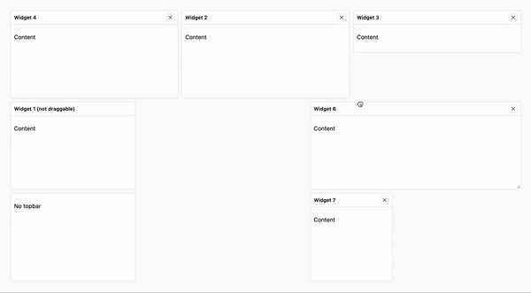

#  Dashup


<p>&nbsp;</p>


<br>

Highly customizable and performant **React** components specifically designed for creating interactive dashboards. With a focus on simplicity and flexibility, this library empowers developers to effortlessly build stunning dashboard interfaces.

#### Built with 🖤 and lots of

<div style="display: flex; flex-direction: row;">
  
  
</div>

<br>



<br>

### 🚨 Important Notice

This component are under development. Is not ready for production!

## Examples

See in action in the [Storybook](https://builtbyedgar.github.io/dashup/)

#### More examples (soon)

- Codesandbox
- Stackblitz

## Features

Dashup provides a simple and versatile solution for building interactive dashboards in your **React** applications. With its intuitive API and extensive customization options, you can create dynamic and visually appealing dashboards in no time.

Whether you need draggable and resizable widgets for flexible layout arrangements, static widgets for displaying static information or visual elements, or a serialized layout for saving and loading dashboard configurations, this component library has you covered.

#### ⚛️ 100% React & TypeScript

The components are built using React and TypeScript, ensuring type safety and a seamless integration with your existing React projects.

#### 🍿 Zero dependencies

The library has no external dependencies, making it lightweight and easy to manage.

#### 🎛️ Draggable and resizable widgets

Intuitively drag and rearrange widgets within the dashboard to suit your needs. Resize widgets dynamically to optimize the layout and maximize content visibility.

#### ⏸️ Static widgets

Create static widgets for displaying non-interactive information or visual elements.

#### Serialized layout

Save and load the dashboard layout effortlessly using a serialized format.

#### 🎨 Fully customizable

Customize the appearance, behavior, and styling of the components to match your application's branding and requirements.

#### 🔋 High performance

Utilizing the best practices of React performance optimization, the library ensures smooth rendering and fluid user experiences.

#### 📘 Storybook integration

Utilize the power of [Storybook](https://storybook.js.org/) for easy development and interactive documentation.

## Requirements

- React >= 18
- ReactDOM >= 18

## Usage

Getting started with the **Dashup** is quick and straightforward. Follow the steps below to install the package and begin using the components in your project.

### Installation

To install the **Dashup**, use the package manager of your choice:

#### NPM

```bash
npm install dashup
```

#### Yarn

```bash
yarn add dashup
```

#### PNPM

```bash
pnpm install dashup
```

## Properties

The `<Dashboard />` component exposes a simple but effective API:

- `widgets: Layout`
- `columns?: number` default `12`
- `rowHeight?: number` default `100`
- `margin?: [number, number]` default `[10, 10]`
- `draggableHandle?: string`
- `onChange?: (widgets: Layout) => void`
- `onResize?: () => void`

```tsx
const widget: WidgetProps = {
  id: uuidv4(),
  x: 0,
  y: 2,
  width: 3,
  height: 2,
  title: 'Widget 1',
  draggable: true,
  removible: true,
  stationary: false,
  component: <ComponentForWidget />,
}

const widgets: Layout = [widget, ...]

<Dashboard
  widgets={widgets}
  columns={12}
  rowHeight={100}
  onChange={handleDashboardChange}
/>
```

#### Widget props

```ts
interface WidgetProps {
  id: string
  /** in column units */
  x: number
  /** in row units */
  y: number
  /** in column units */
  width: number
  /** in row units */
  height: number
  /** in column units */
  minWidth?: number
  /** in row units */
  minHeight?: number
  /** in column units */
  maxWidth?: number
  /** in row units */
  maxHeight?: number
  /** static widget */
  stationary?: boolean
  /** draggable widget */
  draggable?: boolean
  /** resizable widget */
  resizable?: boolean
  /** removible widget */
  removible?: boolean
  /** the widget title */
  title?: string
  /** the widget content */
  component?: JSX.Element
  /** the widget options (in development) */
  options?: WidgetOption[]
}
```

#### WidgetOption

```ts
type WidgetOption = {
  title?: string // To show in the Tooltip
  action: () => void
  icon: JSX.Element
}
```

## Todo's

I'm actively seeking help to ensure the quality and reliability of the library through comprehensive testing. If you have experience with testing React components and would like to contribute, I would greatly appreciate your assistance. Whether it's writing unit tests, integration tests, or providing feedback on existing tests, your contributions will make a significant impact.

- [ ] ♻️ Code refactor
- [ ] ⚡️ Extra features
- [ ] 📘 More Storybook examples and customizations
- [ ] 💻 Codesandbox and Stackblitz examples
- [ ] 📄 Docuentation
- [ ] 🔬 Test
- [x] 📦 Publish package (beta)

## Contributing

Please, help me for test the component 🙏🏻

I welcome contributions from the community! If you'd like to contribute to this project, please review the [contribution guidelines](CONTRIBUTING.md) and submit a pull request.

## License

This project is licensed under the [MIT](LICENSE.md) License.
